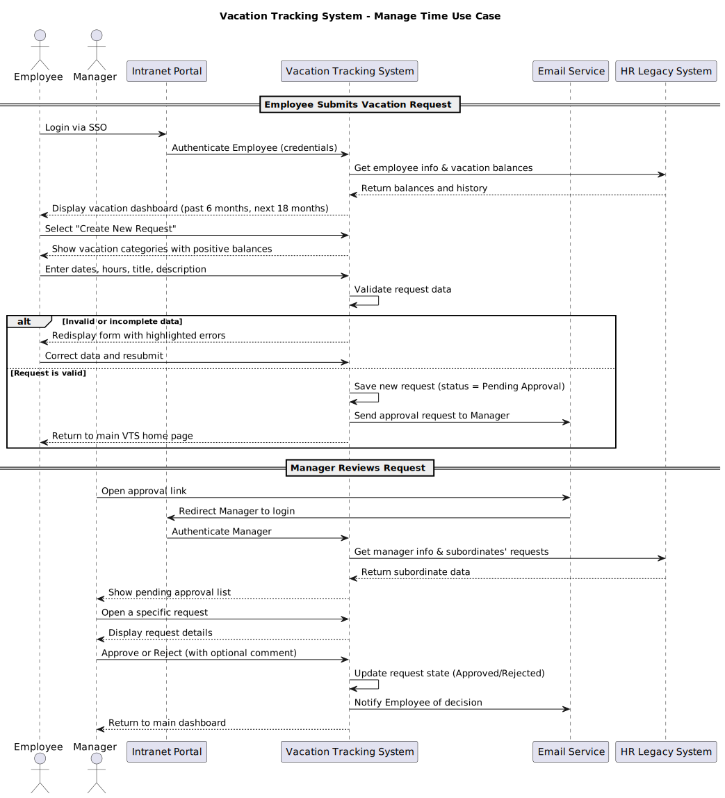

# Vacation-Tracking-System

## 1. Vision

The Vacation Tracking System (VTS) aims to provide employees with a simple and intuitive platform to manage their vacation time, sick leave, and personal leave without needing deep knowledge of HR or local policies.
The system’s ultimate purpose is to empower employees, streamline HR operations, and reduce management’s administrative workload — all while ensuring a smooth, automated, and transparent process for leave management.


## 2. Functional Requirements


-   Implement a flexible engine for validating and verifying all leave requests according to company and local policies.
    
-   Support optional approval by a direct manager before a request is finalized.
    
-   Allow access to leave data from the previous calendar year and support scheduling up to 18 months in advance.
    
-   Automatically send email alerts to managers for approvals and to employees when request statuses change.
        
-   Record activity logs for all system transactions.
    
-   Enable HR or admins to override system restrictions, with all such actions logged for accountability.
    
-   Allow managers to directly award additional personal leave within predefined limits.
    
-   Expose a secure interface for internal systems to query an employee’s vacation summary.
        


## 3. Non-Functional Requirements
    
-   💡 **Ease of Use:** The interface must be intuitive and user-friendly for both employees and managers.
    
-   ⚡ **Performance:** The system should process and respond to requests with minimal delay, improving over previous manual workflows.
    
-   🧱 **Reliability:** All transactions and approvals must be logged to ensure traceability and compliance.
    
-   🔐 **Security:** Authentication must rely on the enterprise’s existing SSO framework, maintaining centralized user control.
    
    

## 4. Constraints

-   The application must be developed as a Web-based intranet extension (not a standalone product).
    
-   Must integrate with existing with intranet poratal system as an extenstion
    
-   Must reuse existing hardware, middleware, and portal infrastructure already in use by the organization.
    
-   Compliance with company data policies.
    
-   Adhere to company-defined approval hierarchy.
    


## 5. Assumptions

-   Every employee belongs to a single department and has one manager.
    
-   All employees have access to the organization’s intranet portal and can log in via SSO.
    

## 6. Actors

- **Employee** : Uses the system to view, create, and manage their own vacation and leave requests.
- **Manager** : Approves or rejects employee leave requests and can grant additional leave within limits.
- **HR Clerk** : Maintains employee records, updates leave data, and ensures information accuracy across systems.
- **System Administrator** : Manages system operations, performance, and technical maintenance.

## 7. Sequence Diagram


## 8. FlowChart
```mermaid
flowchart TD

A[Start] --> B[Employee logs into Intranet Portal]
B --> C[VTS authenticates Employee via SSO]
C --> D[Retrieve vacation data from HR system]
D --> E["Display dashboard (past 6 months and next 18 months)"]

E --> F[Employee selects 'Create New Request']
F --> G[Employee enters dates, hours, and description]
G --> H[Validate request]

H -->|Invalid data| I[Show errors on form]
I --> J[Employee corrects and resubmits]
J --> H

H -->|Valid data| K[Save request (status: Pending Approval)]
K --> L[Send email notification to Manager]
L --> M[Return Employee to VTS Home Page]

M --> N[Manager receives email with approval link]
N --> O[Manager logs into Portal and VTS]
O --> P[Manager views pending requests]
P --> Q[Manager approves or rejects request]
Q --> R[Update request state in VTS]
R --> S[Send notification email to Employee]
S --> T[End]
```