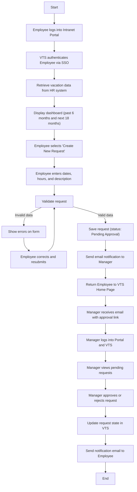

# Vacation-Tracking-System

## 1. Vision

The Vacation Tracking System (VTS) aims to provide employees with a simple and intuitive platform to manage their vacation time, sick leave, and personal leave without needing deep knowledge of HR or local policies.
The system’s ultimate purpose is to empower employees, streamline HR operations, and reduce management’s administrative workload — all while ensuring a smooth, automated, and transparent process for leave management.


## 2. Functional Requirements


-   Implement a flexible engine for validating and verifying all leave requests according to company and local policies.
    
-   Support optional approval by a direct manager before a request is finalized.
    
-   Allow access to leave data from the previous calendar year and support scheduling up to 18 months in advance.
    
-   Automatically send email alerts to managers for approvals and to employees when request statuses change.
        
-   Record activity logs for all system transactions.
    
-   Enable HR or admins to override system restrictions, with all such actions logged for accountability.
    
-   Allow managers to directly award additional personal leave within predefined limits.
    
-   Expose a secure interface for internal systems to query an employee’s vacation summary.
        


## 3. Non-Functional Requirements
    
-   💡 **Ease of Use:** The interface must be intuitive and user-friendly for both employees and managers.
    
-   ⚡ **Performance:** The system should process and respond to requests with minimal delay, improving over previous manual workflows.
    
-   🧱 **Reliability:** All transactions and approvals must be logged to ensure traceability and compliance.
    
-   🔐 **Security:** Authentication must rely on the enterprise’s existing SSO framework, maintaining centralized user control.
    
    

## 4. Constraints

-   The application must be developed as a Web-based intranet extension (not a standalone product).
    
-   Must integrate with existing with intranet poratal system as an extenstion
    
-   Must reuse existing hardware, middleware, and portal infrastructure already in use by the organization.
    
-   Compliance with company data policies.
    
-   Adhere to company-defined approval hierarchy.
    


## 5. Assumptions

-   Every employee belongs to a single department and has one manager.
    
-   All employees have access to the organization’s intranet portal and can log in via SSO.
    

## 6. Actors

- **Employee** : Uses the system to view, create, and manage their own vacation and leave requests.
- **Manager** : Approves or rejects employee leave requests and can grant additional leave within limits.
- **HR Clerk** : Maintains employee records, updates leave data, and ensures information accuracy across systems.
- **System Administrator** : Manages system operations, performance, and technical maintenance.

## 7. Request State Diagram


## 8. Use Case: Manage Time
### 8.1 Sequence Diagram


### 8.2 FlowChart


## 9. Use Case: Withdraw Request
### 9.1 Sequence Diagram


### 9.2 FlowChart
```mermaid
flowchart TD

A[Employee navigates to VTS via intranet portal (SSO authenticated)] --> B[VTS displays homepage with summary & balances]

B --> C[Employee selects a pending vacation request to withdraw]

C --> D[VTS prompts employee to confirm withdrawal]

D --> E{Employee confirms?}

E -->|Yes| F[Remove request from manager's pending approvals list]
E -->|No| B

F --> G[Send notification email to manager]

G --> H[Update request status to WITHDRAWN]

H --> I[End]
```

## 10. Use Case: Cancel Approved Request
### 10.1 Sequence Diagram


### 10.2 FlowChart
```mermaid
flowchart TD

A[Employee navigates to VTS via intranet portal (SSO authenticated)] --> B[VTS displays homepage with summary & balances]

B --> C[Employee selects an approved request to cancel (future or recent past)]

C --> D{Is the request in the future?}

D -->|Yes| E[VTS prompts employee to confirm cancellation]
D -->|No (Recent past)| F[VTS prompts confirm + request explanation]

E --> G{Employee confirms cancellation?}
F --> G{Employee confirms cancellation?}

G -->|Yes| H[Employee provides required information]
G -->|No| B

H --> I[Send notification email to manager]

I --> J[Change request state to CANCELED]

J --> K[Return time allowances to employee]

K --> B[Return to Homepage and update summaries]
```

## 11. Use Case: Edit Pending Request
### 11.1 Sequence Diagram


### 11.2 FlowChart
```mermaid
flowchart TD

A[Employee navigates to VTS via intranet portal (SSO authenticated)] --> B[VTS displays homepage with summaries & balances]

B --> C[Employee selects a pending request to edit]

C --> D[VTS displays editable view (title, comments, dates) \n employee may edit or withdraw]

D --> E{Did employee choose to withdraw?}

E -->|Yes| F[VTS prompts for confirmation]
F --> G{Employee confirms withdrawal?}
G -->|Yes| H[Withdraw request]
H --> I[Return to VTS Homepage]
I --> B
G -->|No| D

E -->|No (Employee edits fields)| J[Employee submits edits]

J --> K{Are there validation errors?}

K -->|Yes| L[Redisplay edit page and show errors]
L --> D

K -->|No| M[Accept changes]
M --> I[Return to VTS Homepage (updated summaries)]
```